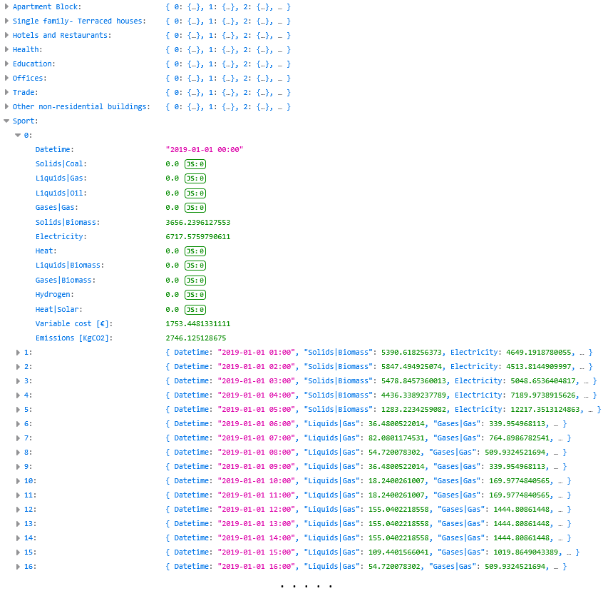

# iDesignRES: Building Stock Energy Model

## Results directory

This directory stores the results in JSON format. Additionally, they can also be stored in Excel format if previously configured to do so.

A JSON result file is generated for each region for which the simulation has been launched:

